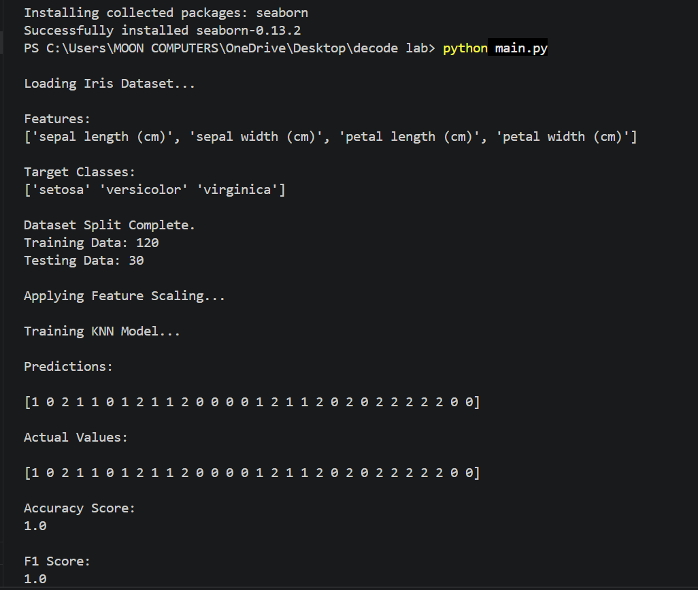
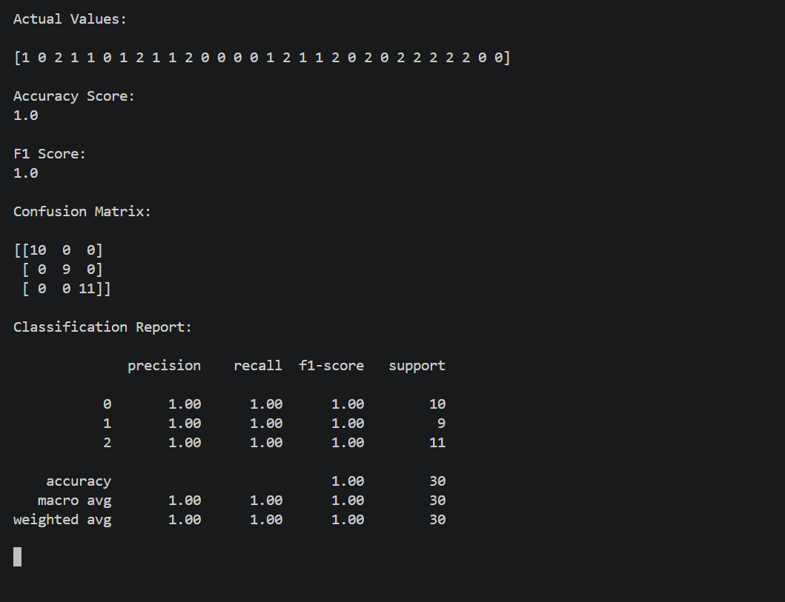
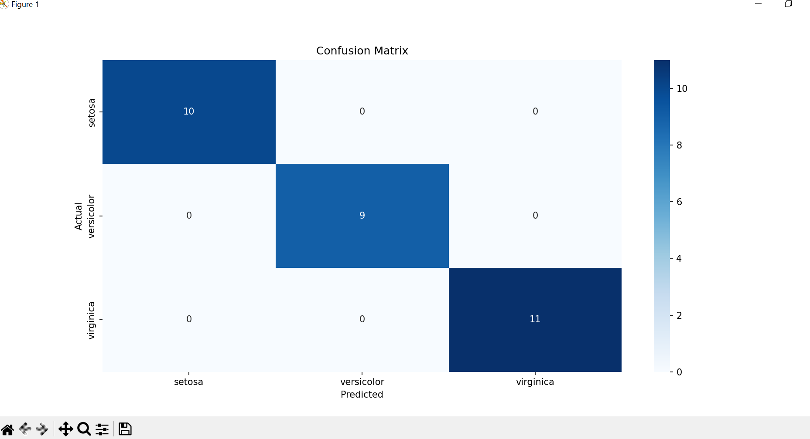

# Data Classification Using AI

## Overview
This project is developed as part of my Artificial Intelligence Internship at DecodeLabs. The main objective of this project is to build a machine learning classification model capable of predicting data categories using supervised learning techniques.

The project uses the famous Iris Dataset and implements the K-Nearest Neighbors (KNN) algorithm for classification tasks. It also demonstrates essential machine learning concepts such as data preprocessing, feature scaling, model training, prediction, and performance evaluation.

---

## Features
- Iris Dataset Classification
- Data Preprocessing
- Train-Test Split
- Feature Scaling using StandardScaler
- K-Nearest Neighbors (KNN) Algorithm
- Accuracy Score Evaluation
- F1 Score Calculation
- Confusion Matrix Visualization
- Classification Report Generation

---

## Technologies Used
- Python
- NumPy
- Pandas
- Scikit-learn
- Matplotlib
- Seaborn

---

## Project Structure

```bash
Project-2-Data-Classification-AI
│
├── main.py
├── requirements.txt
├── README.md
└── screenshots#

# Project Screenshots

### Terminal Output


### Accuracy and F1 Score


### Confusion Matrix

