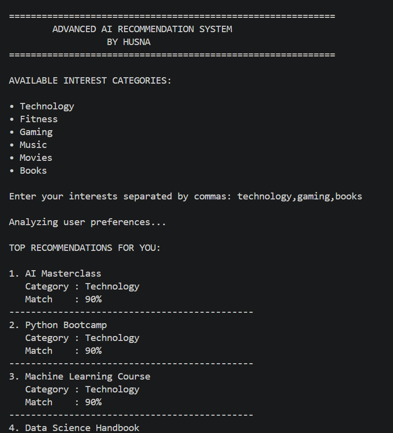
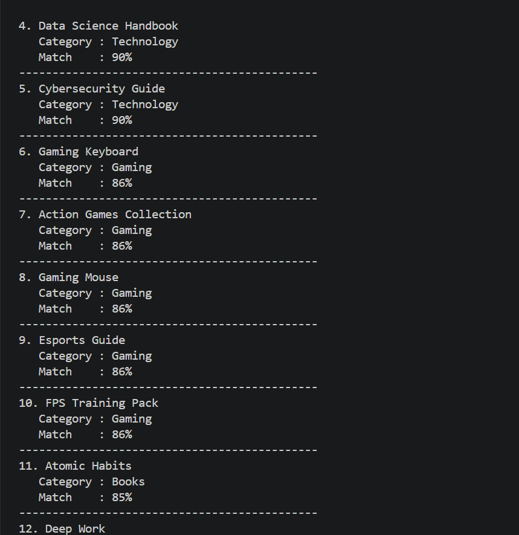
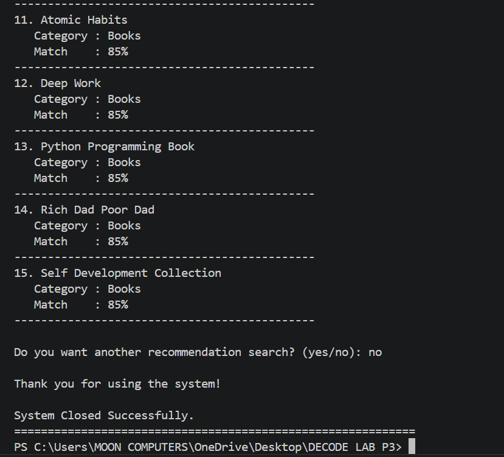

# 🚀 Advanced AI Recommendation System

An intelligent recommendation engine developed using Python as part of the DecodeLabs Artificial Intelligence Internship Program.  
This project analyzes user interests and generates personalized recommendations using logic-based similarity matching and ranking algorithms.

---

# 📌 Project Overview

The Advanced AI Recommendation System is designed to simulate how modern recommendation engines work by understanding user preferences and suggesting relevant content.

The system accepts multiple user interests, processes them using recommendation logic, calculates similarity scores, and displays ranked recommendations in a professional command-line interface.

This project demonstrates fundamental Artificial Intelligence concepts including:

- Recommendation Logic
- Pattern Matching
- Similarity Scoring
- Data Processing
- User Preference Analysis

---

# ✨ Features

✅ Multiple Interest Selection  
✅ Smart Recommendation Engine  
✅ Similarity Score Calculation  
✅ Ranked Recommendations  
✅ Interactive Console Interface  
✅ User-Friendly Design  
✅ Dynamic Data Handling  
✅ Professional Terminal Experience  
✅ Beginner-Friendly AI Logic  

---

# 🛠️ Technologies Used

| Technology | Purpose |
|------------|----------|
| Python | Core Programming Language |
| Dictionaries & Lists | Data Storage |
| Sorting Algorithms | Recommendation Ranking |
| Pattern Matching | Interest Analysis |
| Recommendation Logic | AI-Based Suggestions |

---

# 📂 Project Structure

```bash
Project-3-AI-Recommendation-System/
│
├── main.py
├── README.md
├── requirements.txt
│
└── screenshots/
    ├── output1.png
    ├── output2.png
    └── output3.png
```

---

# ⚙️ Installation & Setup

## Step 1 — Clone Repository

```bash
git clone https://github.com/husnazia304-eng/DecodeLabs-Internship.git
```

---

## Step 2 — Open Project Folder

```bash
cd DecodeLabs-Internship/Project-3-AI-Recommendation-System
```

---

## Step 3 — Install Requirements

```bash
pip install -r requirements.txt
```

---

## Step 4 — Run the Project

```bash
python main.py
```

If `python` does not work:

```bash
python3 main.py
```

---

# ▶️ Sample Run

```bash
============================================================
        ADVANCED AI RECOMMENDATION SYSTEM
              Powered by DecodeLabs
============================================================

AVAILABLE INTEREST CATEGORIES:

• Technology
• Fitness
• Gaming
• Music
• Movies
• Books

Enter your interests separated by commas: Technology, Music

Analyzing user preferences...

TOP RECOMMENDATIONS FOR YOU:

1. AI Masterclass
   Category : Technology
   Match    : 90%

2. Python Bootcamp
   Category : Technology
   Match    : 90%

3. Guitar Lessons
   Category : Music
   Match    : 85%
```

---

# 📸 Output Screenshots

## Home Screen


## Recommendation Results


## Final Output


---

# 🧠 Recommendation Logic

The system works by:

1. Taking user interests as input
2. Matching interests with predefined categories
3. Calculating similarity scores
4. Ranking recommendations
5. Displaying the best matches

---

# 🚀 Future Improvements

The project can be upgraded with:

- Machine Learning Models
- Real-Time Recommendations
- Database Integration
- User Authentication System
- Web Application Version
- GUI Interface using Tkinter or PyQt
- AI-Based Collaborative Filtering
- NLP-Based Recommendations

---

# 🎯 Learning Outcomes

Through this project, the following concepts were practiced:

- Artificial Intelligence Fundamentals
- Recommendation Systems
- Similarity Algorithms
- Python Programming
- Problem Solving
- Data Structures
- Logic Building
- Algorithm Design

---

# 👨‍💻 Developed By

**ABDULLAH ZIA**  
AI Intern at DecodeLabs

GitHub:  
https://github.com/husnazia304-eng

---

# 🏢 Internship Program

This project was developed as part of the Artificial Intelligence Internship Program by DecodeLabs.

---

# ⭐ Support

If you like this project, consider giving it a ⭐ on GitHub.

---
